# Måla

**Måla** is swedish for painting. This is a lightweight (less than 7kB) library to paint on the HTML5 ```<canvas>``` element.

## Setup

### Use with browserify

```
$ npm install mala
```

And 

```
var Mala = require('mala')
```

### Use directly in an HTML page

Download ```mala.min.js``` [here](https://raw.githubusercontent.com/idris-maps/mala/master/dist/mala.min.js)

And add it to the page

```
<script src="mala.min.js"></script>
```

## Usage

### Initialise

Add a ```<div>``` to your HTML with a unique id.

```
<div id="myPainting"></div>
```

Add a canvas within the div by creating a new instance of Måla that takes two arguments:
* The id of the div
* The desired size of the canvas

```
var paint = new Mala('myPainting', { width: 1000, height: 500 })
```

Now you can add **rectangles**, **circles**, **lines**, **polygons**, **text** and **images** (see below). When you are done, draw the canvas with

```
paint.draw()
```

### Add a rectangle

```
var firstRectangle = paint.rect(10, 10, 100, 50)
```

```.rect(x,y,width,height)``` takes four arguments:
* x: The number of pixels to the right of the top-left corner
* y: The number of pixels down from the top-left corner
* width (in pixels)
* height (in pixels)

#### Style options

* ```fill```: Any HTML color (defaults to ```'black'```)
* ```stroke```: Any HTML color (defaults to ```undefined```)
* ```opacity```: A number between 0 and 1 (defaults to ```1```)
* ```lineWidth```: The width in pixels of the ```stroke``` (defaults to ```1```)
* ```lineJoin```: The shape of the corners of the ```stroke``` (defaults to ```miter```, other possibilities are ```round``` and ```bevel```)

Set the styles like this:

```
firstRectangle.fill = 'blue'
firstRectangle.stroke = 'red'
```

Example: 

```
var paint = new Mala('c', {width: 200, height: 100})

// Create the rectangle
var firstRectangle = paint.rect(10, 10, 100, 50)

// Set the style
firstRectangle.fill = 'blue'
firstRectangle.stroke = 'red'
firstRectangle.lineWidth = 5

// Render
paint.draw()
```

Looks like this:

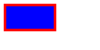

### Add a circle

```
var firstCircle = paint.circle(50, 30, 20)
```

```.circle(x,y,r)``` takes four arguments:
* x: The number of pixels to the right of the top-left corner
* y: The number of pixels down from the top-left corner
* r: The radius in pixels

#### Style options

* ```fill```: Any HTML color (defaults to ```'black'```)
* ```stroke```: Any HTML color (defaults to ```undefined```)
* ```opacity```: A number between 0 and 1 (defaults to ```1```)

Set the styles like this:

```
firstCircle.fill = 'green'
```

### Add a line

```
var firstLine = paint.line([[10,10],[20,20],[20,30]])
```

```.line([[x1,y1],[x2,y2],[x3,y3]])``` takes one argument: an array of x and y coordinates

To draw curves add one or two control points like this:

```
.line([[x1,y1],[ctrlPoint1-x,ctrlPoint1-y,x2,y2],[x3,y3]])
```

(with one control point)

or 

```
.line([[x1,y1],[ctrlPoint1-x,ctrlPoint1-y,ctrlPoint2-x,ctrlPoint2-y,x2,y2],[x3,y3]])
```

(with two control points)

Example with a simple line:

```
paint.line([[20,50],[180,50])
```

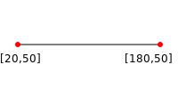

With one control point at [100,20]

```
paint.line([[20,50],[100,20,180,50])
```

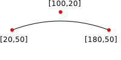

With two control points at [40,20] and [160,20]

```
paint.line([[20,50],[40,20,160,20,180,50])
```

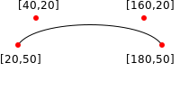


#### Style options

* ```stroke```: Any HTML color (defaults to ```'black'```)
* ```opacity```: A number between 0 and 1 (defaults to ```1```)
* ```lineWidth```: The width in pixels of the ```stroke``` (defaults to ```1```)
* ```lineJoin```: The shape of the corners of the ```stroke``` (defaults to ```miter```, other possibilities are ```round``` and ```bevel```)
* ```lineCap```: The shape of the ends of the line (defaults to ```butt```, other possibilities are ```round``` and ```square```)

Set the styles like this:

```
firstLine.lineWidth = 5
firstLine.lineCap = 'round'
```

### Add a polygon

```
var firstPolygon = paint.polygon([[10,10],[20,20],[20,30]])
```

```.polygon([[x1,y1],[x2,y2],[x3,y3]])```, like ```.line()```, takes one argument: an array of x and y coordinates. You do not need to complete the polygon (with the same coordinates at the end of the array as in the first) it will do that automatically. For curved sides of the polygon, add control points as with ```.line()```

#### Style options

* ```fill```: Any HTML color (defaults to ```'black'```)
* ```stroke```: Any HTML color (defaults to ```undefined```)
* ```opacity```: A number between 0 and 1 (defaults to ```1```)
* ```lineWidth```: The width in pixels of the ```stroke``` (defaults to ```1```)
* ```lineJoin```: The shape of the corners of the ```stroke``` (defaults to ```miter```, other possibilities are ```round``` and ```bevel```)

Set styles like this:

```
firstPolygon.fill = 'yellow'
```
### Add text

```
var firstText = paint.text('Hello world', 20, 30)
```

```.text(txt,x,y)``` takes three arguments:
* txt: The text string
* x: The number of pixels to the right of the top-left corner
* y: The number of pixels down from the top-left corner

#### Style options

* ```fill```: Any HTML color (defaults to ```'black'```)
* ```font```: A string with the font-size (followed by ```px```) and the font-family (defaults to ```'12px sans-serif'```)
* ```stroke```: Any HTML color (defaults to ```undefined```)
* ```opacity```: A number between 0 and 1 (defaults to ```1```)
* ```lineWidth```: The width in pixels of the ```stroke``` (defaults to ```1```)

Set styles like this:

```
firstText.font = '20px Helvetica'
``` 

Example:

```
var paint = new Mala('c', {width: 200, height: 100})

// Add text
var firstText = paint.text('Hello world', 20, 30)

// Set style
firstText.font = '30px Helvetica'
firstText.fill = undefined
firstText.stroke = 'red'

// Render
paint.draw()
```


### Add an image

In order to add an image to the canvas, you first need to add the image file

```
var myImage = paint.addImageFile('theImage.png')
```

```.addImageFile(pathToImage)``` takes one argument, the path to the file.

**..............................................................................**

**WARNING** 

```paint.draw()``` waits until all images are loaded to draw on canvas. If the path does not lead to a file, the **canvas will not be drawn**. 

If you are doing an animation, use ```.addImageFile()``` before starting the animation. Even if you are not going to use it in the first frames.  

**..............................................................................**

Once you have added a file with ```.addImageFile()```, you can add the image to the canvas like this:

```
var firstImage = paint.image(myImage, 10, 10)
```

```.image(img, x, y)``` takes three arguments:
* img: the image loaded with ```.addImageFile()```
* x: The number of pixels to the right of the top-left corner
* y: The number of pixels down from the top-left corner

You can add an image several times using ```.addImageFile()``` once:

```
var myImage = paint.addImageFile('theImage.png')
var firstImage = paint.image(myImage, 10, 10)
var secondImage = paint.image(myImage, 100, 100)
```

#### Style options

* ```opacity```: A number between 0 and 1 (defaults to ```1```)
* ```width```: the width in pixels (defaults to the image files naturalWidth)
* ```height```: the height in pixels (defaults to the image files naturalHeight)

If only ```width```, or only ```height```, is defined the aspect ratio will be preserved. If both are used, the image will have the defined ```width``` and ```height```.

Examples with this image (100px wide and 80px high)

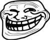

Add it to canvas

```
var paint = new Mala('c', {width: 200, height: 100})

// Setting a gray background to better see the image on the canvas
var r = paint.rect(0,0,200,100)
r.fill = 'lightgray'

// Add the file
var img = paint.addImageFile('troll.png')

// Add the image
var img1 = paint.image(img, 0, 0)

// Render
paint.draw()
```

It looks like this:

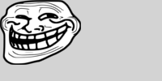

If we set only the width:

```
var img1 = paint.image(img, 0, 0)
img1.width = 50
```

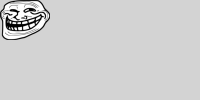

If we set only the height:

```
var img1 = paint.image(img, 0, 0)
img1.height = 100
```

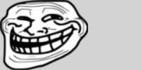

If we set both width and height:

```
var img1 = paint.image(img, 0, 0)
img1.width = 50
img1.height = 100
```

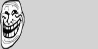

### Layers

When ```paint.draw()``` is triggered, all objects will be drawn in the order they have been added. The last above the ones before.

If we draw a rectangle, then a circle. The circle will be on top of the rectangle.

```
var paint = new Mala('c', {width: 200, height: 100})

var rect = paint.rect(0,0,100,50)
rect.fill = 'blue'
rect.layer = 1

var circle = paint.circle(70,60,40)
circle.fill = 'red'

paint.draw()
```

Looks like this:

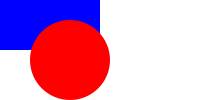

By default all added objects are on layer 0 (the bottom layer). If we want the rectangle in the example above to be on top although it is created before:

```
var paint = new Mala('c', {width: 200, height: 100})

var rect = paint.rect(0,0,100,50)
rect.fill = 'blue'
rect.layer = 1 // <-- new line setting "rect" on layer 1

var circle = paint.circle(70,60,40)
circle.fill = 'red'

paint.draw()
```

Looks like:

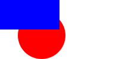

### Animation

**Måla** does not provide any animation method, you will have to use your own. It does have two features that will help you animating: 
* the ```.move()``` method
* the ```.show``` property 

#### .move()

Every object (rectangle, circle, line, polygon, text or image) can be "moved" with the method ```.move()```.

```.move(x,y)``` takes two arguments:
* x: the number of pixels by which we want to move the object horizontally
* y: the number of pixels by which we want to move the object vertically

If we want to have a square moving across the canvas from left to right:

```
var paint = new Mala('c', {width: 200, height: 100}) 

var movingSquare = paint.rect(0,45,10,10) // <-- create the square

setInterval(function() {
	movingSquare.move(1,0) // <-- move it
	paint.draw() // <-- redraw the canvas to see the move
},100)
```

This will move the square one pixel to the right at every interval. Here the interval is set to 100, a tenth of a second.

Another way of animating is to move not at a certain interval in milliseconds but every time the screen is refreshed on your device by using ```requestAnimationFrame()``` instead of ```setInterval()```

This does the same using ```requestAnimationFrame()```. It is a bit faster because the screen is usually refreshed more often than every tenth of a second.

```
var paint = new Mala('c', {width: 200, height: 100}) 

var movingSquare = paint.rect(0,45,10,10) // <-- create the square

requestAnimationFrame(animate)

function animate() {
	movingSquare.move(1,0) // <-- move it
	paint.draw() // <-- redraw the canvas to see the move
	requestAnimationFrame(animate)
}
```

#### .show

Every object has a ```show``` attribute. By default it is set to ```true```, you can set it to ```false``` when you want the object not to be shown on the next frame but do not want to remove it permanently.

If we want to have a blinking circle:

```
var paint = new Mala('c', {width: 200, height: 100})

var blinkingCircle = paint.circle(100,50, 20)

setInterval(function() {

	// set "show" to "false" if it is "true". If is "false", set it to "true"

	if(blinkingCircle.show === true) {
		blinkingCircle.show = false
	} else {
		blinkingCircle.show = true
	}

	paint.draw() // <-- redraw

},500)
```

#### paint.remove()

If you want to permanently remove an object from the canvas:

```
paint.remove(blinkingCircle)
```


